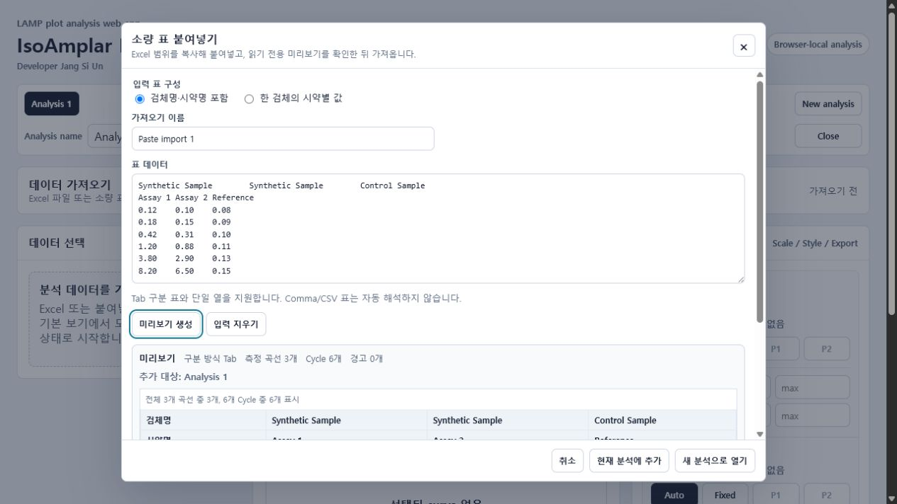
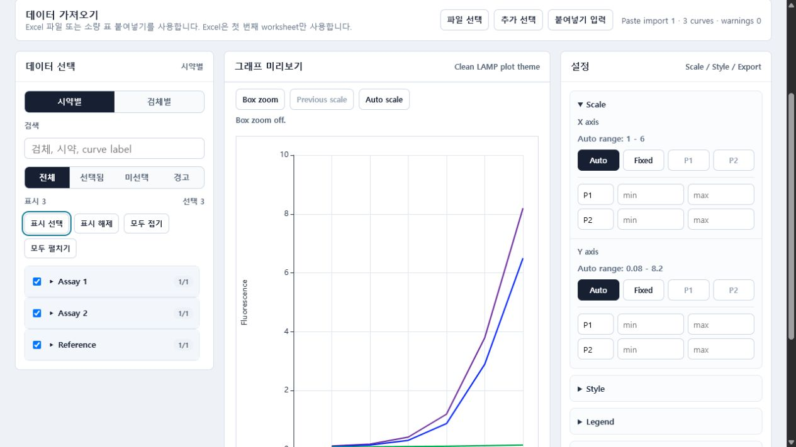
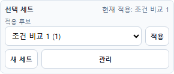
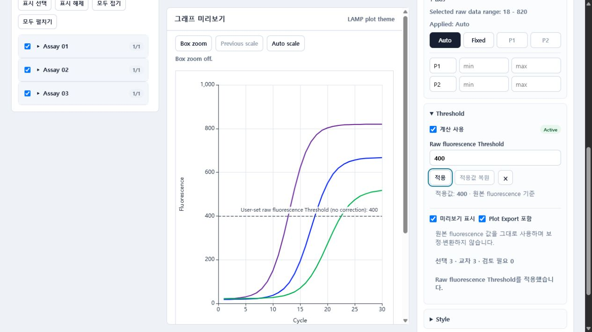
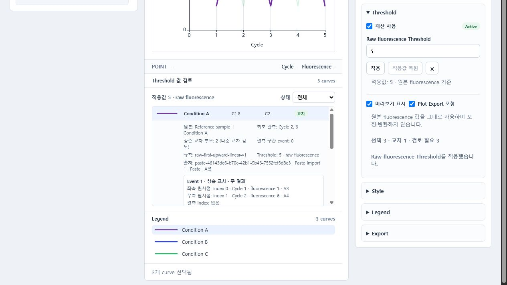
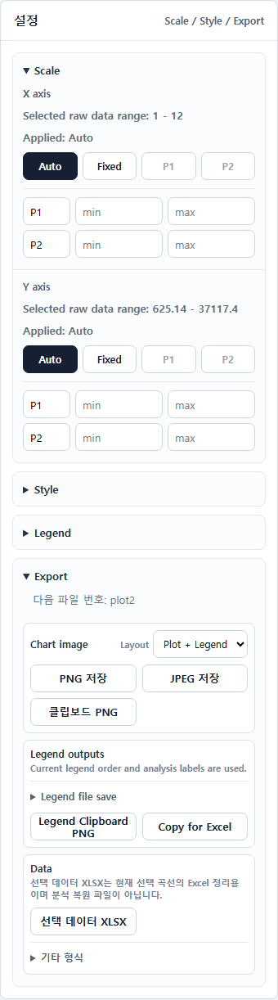

# IsoAmplar Plot Analysis T 최초 사용자용 상세 가이드

- 앱: https://siun-comp.github.io/isoamplar-plot-analysis-t/
- 개발자: Jang Si Un
- 가이드 기준일: 2026-07-14
- 예시 데이터: `Synthetic Sample`, `Control Sample`, `Assay 1`, `Assay 2`, `Reference`와 합성 fluorescence 값만 사용
- 권장 환경: Windows 데스크톱 Chrome 또는 Edge의 최신 버전

이 도구는 LAMP 증폭형광 데이터를 브라우저에서 선택, 비교, 시각화하고 결과를 내보내기 위한 분석 보조 도구다. 사용자가 지정한 raw fluorescence Threshold의 기하학적 교차를 검토할 수 있지만, 임상 판독, 양성/음성 판단, Threshold 자동 산정, Ct/Cq 계산 도구가 아니다.

## 1. 빠른 시작

1. `원본 데이터 열기`로 Excel 파일을 가져오거나 `빠른 붙여넣기`를 연다.
2. 데이터 형식과 warning을 확인한다.
3. 시약별 또는 검체별 보기에서 비교할 curve만 선택한다.
4. 반복 비교 조합은 선택 세트로 저장하고 Scale, Style, Legend, Analysis Labels를 조정한다.
5. 필요하면 하나의 raw fluorescence Threshold를 적용하고 관측값과 선형 교차 추정값을 함께 검토한다.
6. PNG/JPEG, Clipboard PNG, Legend 출력, 선택 데이터 XLSX 중 목적에 맞는 결과를 만든다.
7. 나중에 분석을 이어갈 경우 Analysis XLSX를 저장한다.

## 2. Excel 입력 형식

앱은 file picker로 선택한 `.xls`와 `.xlsx`의 첫 번째 worksheet만 사용한다. Drag and drop과 worksheet 선택은 제공하지 않으며, 각 열은 하나의 curve다.

| 위치 | 의미 | 합성 예시 |
| --- | --- | --- |
| 1행 | 검체 또는 조건 이름 | Synthetic Sample |
| 2행 | 시약 또는 채널 이름 | Assay 1 |
| 3행 이후 | Cycle 순서의 fluorescence 숫자 | 0.12, 0.18, 0.42 |

- X축은 가장 긴 데이터 열을 기준으로 `Cycle 1..N`을 생성한다.
- 수식은 workbook에 cached numeric value가 있을 때만 읽으며 앱이 재계산하지 않는다.
- 검체명이나 시약명이 비어 있어도 fluorescence가 있으면 curve를 가져오고 warning을 표시한다.
- 내부 빈 값과 숫자가 아닌 값은 `null`로 처리해 선을 연결하지 않는다.
- 원본 숫자에 smoothing, normalization, baseline correction, log transform, averaging, Ct/Cq 계산을 적용하지 않는다.

## 3. 소량 표 붙여넣기

Quick Paste Import는 비교용 curve 몇 개를 추가하기 위해 새 Excel 파일을 만드는 부담을 줄이는 기능이다. spreadsheet 편집기가 아니며, 이미 가져온 데이터를 앱 안에서 수정하지 않는다.

### 검체명·시약명 포함 모드

Excel 입력과 같은 구조를 붙여넣는다.

```text
Synthetic Sample<Tab>Synthetic Sample<Tab>Control Sample
Assay 1<Tab>Assay 2<Tab>Reference
0.12<Tab>0.10<Tab>0.08
0.18<Tab>0.15<Tab>0.09
```

### 한 검체의 시약별 값 모드

검체명을 별도 입력하고, 붙여넣은 표의 1행을 시약명, 2행 이후를 fluorescence로 해석한다.

```text
검체명: Comparison Sample

Assay 1<Tab>Assay 2
0.12<Tab>0.10
0.18<Tab>0.15
```

검체명은 새 import source를 구성할 때만 사용한다. 이미 가져온 curve의 검체명을 바꾸는 기능이 아니다.

### 지원 구분 형식과 제한

- Excel 범위 복사에서 생성되는 Tab 구분 표를 지원한다.
- curve 하나만 복사한 구분자 없는 단일 열을 지원한다.
- comma/CSV 표는 자동 해석하지 않는다. 쉼표가 라벨, 천 단위, 소수점과 충돌해 데이터가 잘못 분리될 수 있기 때문이다.
- custom Cycle 열, quoted CSV, multiline cell, CSV file import는 지원하지 않는다.
- raw text 2,000,000자 또는 250,000 cells를 넘으면 브라우저 안전을 위해 차단한다.
- 10,000 fluorescence cells를 넘으면 대량 입력 안내를 표시하지만 안전 상한 이하면 가져오기를 막지 않는다.

### 미리보기와 warning

`미리보기 생성` 전에는 분석 데이터가 바뀌지 않는다. 미리보기는 읽기 전용이며 다음 정보를 보여준다.

- 구분 방식, curve 수, Cycle 수, warning 수
- 검체명과 시약명
- 처음 12개 curve와 처음 10개 Cycle
- warning 위치와 처리 결과
- 반영 대상 analysis tab

빈 fluorescence 또는 숫자가 아닌 값이 `null`로 바뀌는 경우, 해당 위치와 그래프 gap 결과를 확인하는 checkbox를 선택해야 가져오기 버튼이 활성화된다.

미리보기 후 붙여넣기 원문, 입력 모드, 단일 검체명을 바꾸면 기존 미리보기는 현재 입력과 맞지 않는 상태가 된다. 원래 값으로 되돌려도 다시 미리보기를 생성해야 한다. 가져오기 이름만 바꾸는 것은 fluorescence를 다시 해석하지 않으며 내부 curve 식별값도 바꾸지 않는다.

### 반영 방식

- `현재 분석에 추가`: 기존 selection, scale, style, label, legend/export order를 유지하고 새 curve를 unselected로 끝에 추가한다.
- `새 분석으로 열기`: 독립 analysis tab을 만들고 새 curve는 모두 unselected, 대분류는 접힌 상태로 시작한다.
- 미리보기를 만든 분석이 닫히거나 변경되면 오래된 미리보기의 반영을 차단하고 다시 미리보기를 요구한다.



## 4. 화면 구성

| 영역 | 역할 |
| --- | --- |
| Analysis tabs | 여러 분석을 독립적으로 열고 이름, 저장되지 않은 변경 상태를 관리 |
| 데이터 가져오기 | 원본 데이터 열기, Excel 추가, 빠른 붙여넣기, 저장한 분석 열기 |
| 데이터 선택 | 시약별/검체별 분류, 검색, 필터, curve 선택 |
| 그래프 미리보기 | 선택 curve, Box zoom, point readout, custom legend |
| 설정 | Scale, Threshold, Style, Legend, Export |



### 화면 용어 빠른 해석

| 화면 용어 | 업무상 의미 |
| --- | --- |
| Analysis / analysis tab | 서로 영향을 주지 않는 하나의 분석 작업과 그 탭 |
| Curve | Excel의 한 데이터 열에서 만들어진 검체·시약 조합의 형광 곡선 |
| Unsaved / dirty | 마지막 Analysis XLSX 저장 이후 변경된 내용이 있음 |
| Dataset / source | 현재 분석의 전체 데이터 / 데이터를 가져온 Excel 또는 붙여넣기 원문 |
| `curveId` | 곡선의 선택·순서·스타일을 안전하게 연결하는 내부 식별값. 사용자가 편집하지 않음 |
| stale | 입력 또는 대상 분석이 바뀌어 이전 미리보기·저장 결과를 그대로 반영할 수 없음 |
| Raw / Display | Excel cell의 원래 값 / Excel 표시 형식을 반영한 검체·시약 이름 |
| Warning code | warning 종류를 구분하는 내부 코드. 아래의 위치·처리 결과와 함께 확인 |
| Snapshot / live analysis | 저장을 시작한 시점의 상태 / 현재 화면에서 계속 편집 중인 분석 |

## 5. 데이터 선택과 검색

- 기본 보기는 시약별이다.
- 검체별 보기로 바꿔도 selection은 `curveId` 기준으로 유지된다.
- import 직후 모든 대분류 그룹은 접힌 상태다.
- 검색은 접힌 그룹을 포함한 전체 데이터에 적용된다.
- `표시 선택`과 `표시 해제`는 현재 검색/필터 조건 전체에 적용된다.
- 20개 초과 curve는 가독성 warning과 보조 action을 제공하지만 preview/export를 차단하지 않는다.

### 선택 세트로 반복 비교하기

선택 세트는 같은 분석에서 자주 번갈아 보는 curve 조합을 저장한다. 예를 들어 `조건 비교 1`에 curve 1, 4, 5를 저장하고 `조건 비교 2`에 curve 2, 3, 7을 저장할 수 있다.

1. 비교할 curve를 선택한다.
2. `현재 선택을 새 세트로 저장`을 누르고 이름을 입력한다.
3. 다른 조합도 같은 방법으로 저장한다.
4. 드롭다운에서 세트를 고른 뒤 `적용`을 누르면 현재 선택이 그 조합으로 교체된다.

- 선택을 수동으로 바꾸면 적용된 세트명에 `수정됨`이 표시되며 저장된 세트는 자동으로 덮어쓰지 않는다.
- `관리`에서 현재 선택으로 업데이트, 이름 변경, 삭제, 적용 전 선택으로 돌아가기를 사용할 수 있다.
- 선택 세트는 curve 구성만 저장한다. Scale, Style, Analysis Labels, Legend Order는 바꾸지 않는다.
- Excel 또는 Quick Paste 데이터를 추가해도 기존 세트에 새 curve가 자동으로 포함되지 않는다.
- 선택 세트는 Analysis XLSX에 함께 저장되며 다른 analysis tab과 섞이지 않는다.



## 6. Scale과 Box zoom

| 모드 | 설명 | 권장 상황 |
| --- | --- | --- |
| Auto | 현재 표시 curve에 맞춰 범위 계산 | 초기 탐색 |
| Fixed | 사용자가 min/max 직접 지정 | 비교 이미지의 축 통일 |
| P1/P2 | 분석별 사용자 preset | 반복 범위 전환 |
| Box zoom | plot area를 사각형으로 선택해 Fixed 범위 적용 | 복잡한 구간 확대 |

Box zoom은 데이터 자체를 자르거나 변환하지 않는다. `Previous scale`은 Box zoom 전 scale로 한 단계씩 돌아가고, `Auto scale`은 양 축을 Auto로 바꾸며 return history를 지운다.

## 7. Threshold 설정과 값 검토

Threshold는 분석 탭당 하나를 사용자가 직접 정하는 선택 기능이다. 계산에는 현재 선택한 curve의 원본 `Cycle 1..N`과 raw fluorescence만 사용한다. smoothing, normalization, baseline correction, log 변환 또는 결측값 보간을 적용하지 않는다.

### 적용 순서

1. 우측 `Threshold`를 펼친다.
2. `Raw fluorescence Threshold`에 유한한 숫자를 입력한다. 소수와 지수 표기(예: `2.5e5`)도 사용할 수 있다.
3. `적용`을 누른다. 적용된 값과 현재 입력값이 다르면 기존 적용값으로 계산하며 미적용 상태를 경고한다.
4. `미리보기 표시`와 `Plot Export 포함`을 각각 켜거나 끈다. 두 옵션은 계산 결과를 바꾸지 않는다.
5. 그래프 아래 `Threshold 값 검토`를 펼쳐 curve별 결과를 확인한다.



### 결과 읽는 방법

| 항목 | 의미 |
| --- | --- |
| Cycle축 선형 교차 추정값 | 인접한 두 raw 관측점이 `이전값 < Threshold`, `현재값 >= Threshold`를 만족할 때 두 점 사이를 Cycle축에서 선형 보간한 파생값 |
| 최초 관측 이상점 | 실제로 저장된 raw fluorescence 중 처음으로 Threshold 이상인 Cycle과 fluorescence |
| 교차 | 인접한 두 finite raw 관측점으로 유효한 상승 교차를 계산할 수 있음 |
| 시작점 초과/동일 | 첫 유효 관측값부터 Threshold 이상이므로 그 이전 교차 위치를 알 수 없음 |
| 결측 구간 | `null` 사이에서 Threshold를 넘었을 가능성이 있어 유효한 인접점 보간을 하지 않음 |
| 미도달 | 유효한 상승 교차가 관측되지 않음 |
| 다중 교차 | 상승 교차 후보가 여러 개이며 첫 후보를 대표로 표시하므로 전체 event 검토 필요 |

선형 교차 추정값은 실제 관측값이 아니다. 결과 행에는 최초 관측 이상점이 함께 표시되며, 상세 정보와 선택 데이터 XLSX에는 보간에 사용한 전후 raw point와 원본 위치 근거가 남는다. `null`을 가로질러 교차값을 만들지 않는다.



### Scale, 선택 세트, 여러 원본과의 관계

- Auto/Fixed/P1/P2/Box zoom은 보이는 범위만 바꾸며 Threshold 계산은 선택 curve의 전체 raw 배열을 사용한다.
- Threshold가 현재 Y축 범위 밖이면 축을 자동으로 넓히지 않고 그래프 안에 above/below 안내를 표시한다.
- 선택 세트를 바꾸면 같은 적용값으로 새 선택 curve의 결과를 즉시 다시 계산한다.
- Excel 또는 Quick Paste를 추가하면 Threshold 설정은 유지된다. 서로 다른 source의 raw fluorescence를 하나의 Threshold로 비교할 수 있는지는 사용자가 실험 조건을 확인해야 한다.
- `미리보기 표시`를 꺼도 결과 계산은 유지된다. `Plot Export 포함`을 끄면 PNG/JPEG/plot clipboard에서만 선과 안내가 빠진다.

## 8. Style, Legend, Analysis Labels

- 색상, 선, 마커 기준을 검체별 또는 시약별로 지정할 수 있다.
- 기본 curve는 실선, 마커 없음이다.
- 선은 실선/점선/도트, 마커는 없음/원형/세모/네모를 지원한다.
- 개별 curve override는 그룹 기준보다 우선하며 `Custom` 또는 `Preset` 상태로 구분된다.
- Legend Order는 현재 사용자 순서이며 chart/export/CSV가 같은 순서를 따른다.
- Analysis Labels는 chart legend, report legend, Excel legend copy, plotted CSV header, Analysis XLSX에 적용된다.
- Reset은 원본 검체/시약 기반 라벨로 되돌리며 원본 source metadata는 바뀌지 않는다.

## 9. Export

| 출력 | 용도 | 주요 규칙 |
| --- | --- | --- |
| PNG/JPEG | 그래프 이미지 | 흰 배경, `YYMMDD_분석명_plotN.ext`, 새 분석의 기본 레이아웃은 Plot only |
| Clipboard PNG | 문서에 바로 붙여넣기 | 브라우저 clipboard 권한 필요, PNG/JPEG와 동일한 출력 프로필 |
| Legend Clipboard PNG | 여러 plot과 하나의 legend 조합 | report-readable legend 사용 |
| Copy for Excel | style sample과 label을 Excel의 별도 cell에 붙여넣기 | Chrome/Edge rich clipboard 권장 |
| 선택 데이터 XLSX | 현재 선택 curve의 수치와 출처·warning·Threshold 근거를 Excel에서 정리 | 공통 X축 직사각형 데이터일 때 활성화, 앱 복원 불가 |
| Plotted CSV | 현재 표시 curve의 공통 X축 데이터 | `기타 형식`의 보조 출력 |
| Analysis XLSX | 전체 데이터와 설정 저장 | 선택하지 않은 curve도 포함 |

Plot이 포함된 PNG/JPEG/Clipboard PNG는 Excel에서 약 9.5cm 너비로 배치해도 축 숫자와 곡선을 읽기 쉽도록 별도 출력 프로필을 사용한다. 이미지 자체는 2400px 너비를 유지하므로 9.5cm로 축소해도 해상도를 버리지 않는다. 이 프로필은 글자·여백·선 두께와 주요 눈금 밀도만 조정하며 raw fluorescence, 선택 curve, X/Y Scale, 순서와 스타일 값은 변경하지 않는다. 웹 미리보기의 크기와 모양도 바뀌지 않는다.

선택 데이터 XLSX에는 `PlottedData`, `CurveInfo`, `Warnings`, `ExportInfo`, `ThresholdResults`, `ThresholdEvents`가 들어간다. Threshold를 사용하지 않아도 고정된 sheet 구조를 유지하며 비활성 상태만 기록한다. 활성 상태에서는 curve별 outcome과 최초 관측 이상점, 선형 교차 추정값을 `ThresholdResults`에 기록하고, 전후 raw point·결측 구간·원본 cell 근거를 `ThresholdEvents`에 기록한다. 그래프의 Box zoom이나 표시 Scale과 관계없이 `PlottedData`는 공통 X축 전체 raw 행을 저장하며 fluorescence 숫자를 보정하거나 변환하지 않는다. 이 파일은 Excel 후속 정리용이므로 `원본 데이터 열기`, `Excel 추가`, `저장한 분석 열기`에 다시 넣을 수 없다.



## 10. Analysis XLSX로 분석 이어가기

Analysis XLSX는 Excel 안에서 편집하는 chart workbook이 아니라 IsoAmplar 웹 앱의 restore file이다.

저장 항목:

- 가져온 전체 데이터와 warning
- 선택/미선택, 그룹/검색 상태, 사용자 순서
- 선택 세트 이름, curve 구성, 마지막 적용 세트
- X/Y scale, P1/P2, style, individual override
- Analysis Labels, legend/export 설정
- analysis name과 export counter
- Threshold 활성 상태, 입력값, 마지막 적용값, 계산 규칙 버전, 미리보기/Plot Export 표시 옵션
- Excel/paste source type, immutable source ID, source name, column, paste input mode

Excel과 paste가 섞인 분석도 모든 source와 unselected curve를 포함한다. 구버전 Analysis XLSX에 source type이 없으면 Excel source로 안전하게 복원한다.

앱은 Analysis XLSX를 열 때 curve 길이, Cycle 순서, source 관계, 통계와 설정 참조가 서로 모순되지 않는지 검사하고, 손상되거나 맞지 않는 파일은 새 탭을 만들기 전에 거부한다. 릴리스 자동 테스트는 별도로 저장→복원→재저장을 수행해 모든 curve의 ID, source, X 배열, Y 배열, stats가 정확히 같은지 비교한다. 이 테스트에는 `null`, 음수, 지수값, 큰 fluorescence 값이 포함된다. 이는 릴리스 품질 검증이며, 사용자가 저장할 때마다 앱이 자동으로 독립 재저장 검사를 수행한다는 뜻은 아니다.

저장 중 현재 분석이 바뀌면 생성된 파일은 저장을 시작한 시점의 상태이고, 현재 편집 중인 분석은 Unsaved로 유지되며 자동으로 닫히지 않는다.

저장하지 않은 analysis tab이 하나라도 있으면 브라우저 새로고침 또는 창 닫기 시 브라우저 경고가 표시될 수 있다. 분석을 계속할 가능성이 있으면 먼저 상단 `분석 저장`으로 Analysis XLSX를 만든다.

Threshold 결과 배열은 Analysis XLSX에 고정 저장하지 않는다. 설정과 전체 raw dataset을 저장하고, 다시 열 때 같은 규칙으로 결과를 재계산한다. 따라서 선택 세트나 현재 선택을 바꾸면 복원 후에도 해당 선택에 맞는 결과가 생성된다.

## 11. Warning과 문제 해결

| 상황 | 앱 동작 | 권장 조치 |
| --- | --- | --- |
| 검체명 비어 있음 | curve를 가져오고 missing specimen warning | 원본 또는 paste source 확인 |
| 시약명 비어 있음 | curve를 가져오고 missing reagent warning | 원본 또는 paste source 확인 |
| 두 header 모두 비어 있음 | fluorescence가 있으면 두 warning과 함께 import | 의도한 curve인지 확인 |
| 빈 fluorescence | `null`, graph gap | 누락이 의도인지 확인 |
| 숫자가 아닌 fluorescence | 원문 token warning, `null`, graph gap | 메모/단위 혼입 확인 |
| curve별 길이 차이 | 가장 긴 길이에 맞춰 짧은 curve를 `null`로 채움 | 장비 export와 비교 목적 확인 |
| comma/CSV paste | import 전 차단 | Excel 범위를 Tab 형식으로 다시 복사 |
| 여러 worksheet | 첫 번째 worksheet만 사용 | 분석 sheet를 첫 번째로 배치 |
| formula cache 없음 | 앱이 계산하지 않고 warning | Excel에서 계산 후 저장 |
| clipboard 실패 | fallback message | HTTPS Chrome/Edge 또는 파일 저장 사용 |
| 입력 변경 후 오래된 붙여넣기 미리보기 | 가져오기 버튼 비활성화 | 현재 내용으로 미리보기 재생성 |
| 저장 도중 분석 변경 | 현재 분석을 Unsaved로 유지 | 현재 상태를 다시 저장 |
| 새로고침/창 닫기 경고 | 저장하지 않은 analysis가 있음 | Analysis XLSX 저장 후 다시 시도 |
| 저장한 분석을 원본 열기로 선택 | restore file 용도 불일치 안내 | `저장한 분석 열기` 사용 |
| 원본 Excel을 저장한 분석 열기로 선택 | source file 용도 불일치 안내 | `원본 데이터 열기` 사용 |
| 선택 데이터 XLSX를 앱 입력으로 선택 | Excel 후속 정리용 출력 파일 안내 후 거부 | 분석 재개는 Analysis XLSX, 원자료 재입력은 원본 Excel 사용 |
| Threshold 입력값과 적용값이 다름 | 현재 적용값으로만 계산하고 관련 plot/선택 데이터 출력을 보호 | `적용` 또는 `적용값 복원` 후 다시 출력 |
| Threshold 선이 보이지 않음 | 미리보기 표시가 꺼졌거나 현재 Y축 밖일 수 있음 | 표시 옵션과 범위 밖 안내를 확인 |
| Threshold가 Y축 밖임 | Auto 축을 바꾸지 않고 above/below 안내 표시 | Scale을 바꾸거나 값이 의도한 기준인지 확인 |
| 결측 구간 결과 | `null`을 건너 선형 보간하지 않음 | 전후 raw point와 원본 cell/warning을 확인 |
| 시작점 초과 결과 | 첫 유효 관측 전의 교차 위치를 알 수 없음 | 최초 관측 이상점을 근거로 보고 추정값으로 대체하지 않음 |

유효한 숫자 text는 finite decimal/scientific number로 변환해 같은 수치로 plot한다. 예를 들어 `1e3`은 숫자 `1000`으로 저장된다. 표시 문자열 모양 자체가 아니라 숫자 값의 보존이 보장된다. `NaN`, infinity, hexadecimal, 천 단위 쉼표, decimal comma는 숫자로 인정하지 않는다.

## 12. 권장 작업 흐름

1. 대량 데이터는 Excel 첫 worksheet에 정리한다.
2. 중간 비교용 소량 curve만 Quick Paste로 추가한다.
3. warning과 null 처리 결과를 확인한다.
4. 비교 목적에 필요한 curve를 선택하고 반복 조합은 선택 세트로 저장한다.
5. Scale을 통일하고 그룹 Style을 먼저 적용한다.
6. 필요한 curve만 개별 override하고 Analysis Labels를 정리한다.
7. 필요하면 raw Threshold를 적용하고 관측값, 선형 추정값, 결측·시작 상태를 검토한다.
8. 이미지/legend/선택 데이터 XLSX를 목적에 맞게 export한다.
9. 분석을 이어갈 가능성이 있으면 Analysis XLSX를 저장하고 다시 열어 선택 세트와 Threshold 설정까지 유지되는지 확인한다.

## 13. 현재 제한사항

- CSV file import와 comma/CSV paste parsing은 제공하지 않는다.
- worksheet picker, custom Cycle 열, source cell 편집은 제공하지 않는다.
- 이미 import된 검체명, 시약명, fluorescence를 앱 안에서 수정하지 않는다.
- native editable Excel chart를 생성하지 않는다.
- Threshold 자동 추천, baseline 보정 Threshold, 복수 Threshold, Ct/Cq/Tt/Tp, 양성/음성 또는 임상 판독 계산을 제공하지 않는다.
- clipboard는 브라우저/보안 정책에 따라 실패할 수 있다.
- 모바일 분석 화면은 지원 목표가 아니다. 데스크톱 브라우저를 사용한다.

## 14. 개인정보와 네트워크

- Excel과 Quick Paste 데이터는 앱의 브라우저 메모리에서 처리된다.
- 앱은 서버 저장, 계정, 데이터베이스, 실시간 공동 편집 기능을 사용하지 않는다.
- 릴리스 브라우저 테스트는 화면 구성 파일을 읽는 정상 요청 외에 앱 주소로 데이터를 보내는 요청, 외부 주소 통신, WebSocket 연결이 발생하면 실패로 처리한다.
- PNG/JPEG/CSV/선택 데이터 XLSX/Analysis XLSX/clipboard를 실행하면 사용자가 선택한 결과가 브라우저 밖의 파일 또는 clipboard로 이동한다. 민감한 label이 포함된 결과의 공유 범위는 사용자가 관리한다.

## 15. 최종 검수 체크리스트

- [ ] 실제 민감 label 대신 합성 또는 익명화 label을 사용했는가?
- [ ] warning과 null gap을 확인했는가?
- [ ] 선택 curve와 Legend Order가 의도한 비교 순서인가?
- [ ] 반복 비교 조합이 선택 세트에 정확히 저장되었는가?
- [ ] X/Y scale이 비교 목적에 맞는가?
- [ ] Threshold가 raw fluorescence 기준이라는 점과 실험 조건 간 비교 가능성을 확인했는가?
- [ ] 선형 교차 추정값과 실제 최초 관측 이상점을 혼동하지 않았는가?
- [ ] Style과 Analysis Labels가 export에 일관되게 반영되는가?
- [ ] PNG/JPEG 또는 clipboard 결과를 실제 문서에서 확인했는가?
- [ ] Analysis XLSX를 다시 열어 전체 source와 설정이 유지되는가?
- [ ] 선택 데이터 XLSX와 Analysis XLSX의 용도를 구분해 저장했는가?
